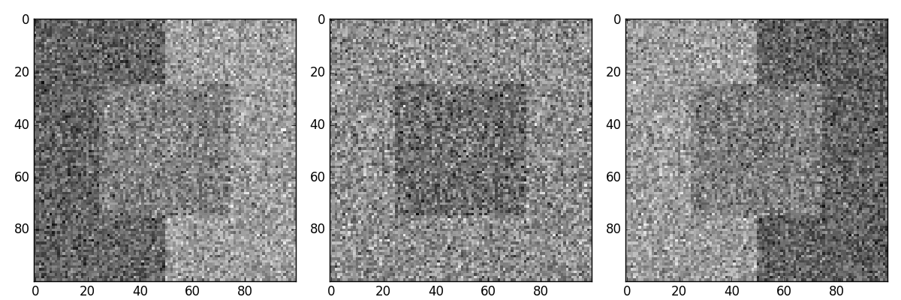
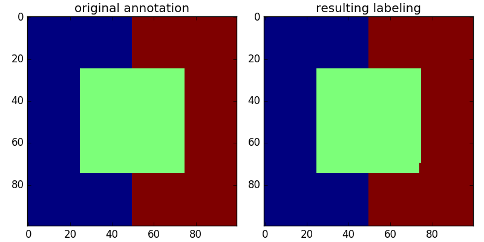

# pygco: a python wrapper for the graph cuts package gco-v3.0

<!---
[](https://travis-ci.org/Borda/pygco)
[](https://ci.appveyor.com/project/Borda/pygco)
-->
[](https://app.codeship.com/projects/197423)

This is a python wrapper for [gco-v3.0 package] (http://vision.csd.uwo.ca/code/), which implements a graph cuts based move-making algorithm for optimization in Markov Random Fields.

It contains a copy of the **gco-v3.0 package**.  Some of the design were borrowed from the [gco_python] (https://github.com/amueller/gco_python) package. However, compared to gco_python:
* This package does not depend on Cython. Instead it is implemented using the ctypes library and a C wrapper of the C++ code.
* This package is an almost complete wrapper for gco-v3.0, which supports more direct low level control over GCoptimization objects.
* This package supports graphs with edges weighted differently.

This wrapper is composed of two parts, a C wrapper and a python wrapper.

## Building wrapper

1. download the last version of [gco-v3.0] (http://vision.csd.uwo.ca/code/gco-v3.0.zip) to the _gco_source_
1. compile gco-v3.0 and the C wrapper using `make`
1. compile test_wrapper using `make test_wrapper`
1. run the C test code `./test_wrapper` (now you have the C wrapper ready)
```
make download
make all
make test_wrapper
./test_wrapper
```

The successful run should return:
```
labels = [ 0 2 2 1 ], energy=19
data energy=15, smooth energy=4
```

Next test the python wrapper using `python test.py`, if it works fine you are ready to use pygco.

To include pygco in your code, simply import pygco module. See the documentation inside code for more details.

## Show test results

Visualisation of the unary terns for 3 labels segmentation



with the initial labeling (left) and estimated labeling (right)


